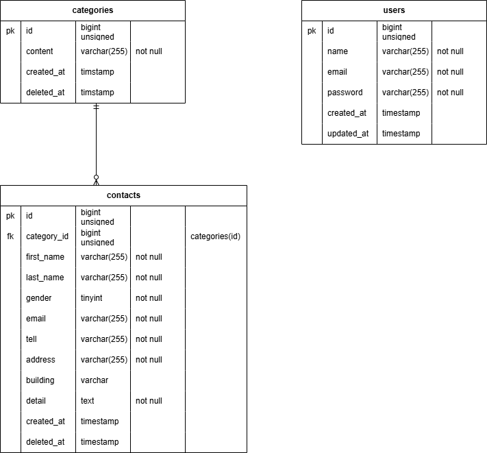

# # アプリケーション名
お問い合わせフォームアプリ（Laravel × Docker）

## 概要
ユーザーが問い合わせ内容を送信し、管理者が内容を確認できるシンプルな問い合わせ管理アプリです。

---

## 環境構築

### 1. リポジトリのクローン
- git clone git@github.com:yukit4mu/test_contact-form.git
### 2. Dockerビルド
- docker-compose up -d --build
### 3. Laravel環境構築
- docker-compose exec php bash
- composer install
- cp .env.example .env , 環境変数を適宜変更    DB_CONNECTION=mysql DB_HOST=mysql DB_PORT=3306 DB_DATABASE=laravel DB_USERNAME=laravel   DB_PASSWORD=laravel

#### 4. アプリケーションキー生成
- php artisan key:generate

### 5. マイグレーション実行
- php artisan migrate

### 6. 初期データ投入（シーディング）
- php artisan db:seed

## 使用技術(実行環境)
- PHP 8.2.11
- Laravel 8.83.8
- MySQL 8.0.26
- nginx 1.21.1

## ER図

## 画面 URL 一覧

### ■ お問い合わせ機能
- お問い合わせフォーム入力ページ：`http://localhost/`
- お問い合わせフォーム確認ページ：`http://localhost/confirm`
- サンクスページ：`http://localhost/thanks`

### ■ 管理画面
- 管理画面トップ：`http://localhost/admin`
- 検索：`http://localhost/search`
- 検索リセット：`http://localhost/reset`
- お問い合わせフォーム削除：`http://localhost/delete`
- エクスポート：`http://localhost/export`

### ■ 認証（Laravel Fortify）
- ユーザー登録：`http://localhost/register`
- ログイン：`http://localhost/login`
- ロログアウト：`http://localhost/logout`

## データベース(操作、確認)
- phpMyAdmin：`http://localhost:8080/`